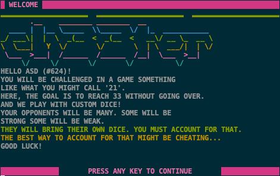
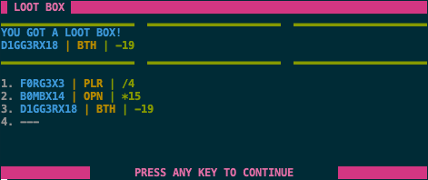
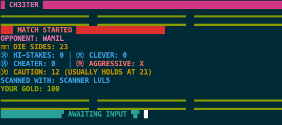
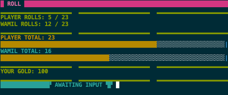

## INTRO

Ch33ter is a cross-platform terminal game written in C (99).

    YOU WILL BE CHALLENGED IN A GAME SOMETHING
    LIKE WHAT YOU MIGHT CALL '21'.
    HERE, THE GOAL IS TO REACH 33 WITHOUT GOING OVER.
    AND WE PLAY WITH CUSTOM DICE!
    YOUR OPPONENTS WILL BE MANY. SOME WILL BE
    STRONG SOME WILL BE WEAK.
    THEY WILL BRING THEIR OWN DICE. YOU MUST ACCOUNT FOR THAT.
    THE BEST WAY TO ACCOUNT FOR THAT MIGHT BE CHEATING...
    
    GOOD LUCK!

## SCREENSHOTS

 

 

 

 
## BASIC GAMEPLAY
-  USE THESE CHEATS TO HELP YOU WIN MATCHES
-  GAIN MORE CHEATS BY WINNING MATCHES
-  INSPECT YOUR CHEATS BY PRESSING E
-  INSPECT YOUR OPPONENT BY PRESSING Q
-  ROLL BY PRESSING R
-  HOLD BY PRESSING W
-  USE CHEATS BY PRESSING 1, 2 AND SO ON

THE GOAL IS TO GET AS HIGH OF A SCORE AS YOU CAN
WITHOUT GOING OVER 33

## COMMANDS
```
R - ROLL
W - HOLD
E - INSPECT CHEAT SLOTS
Q - INSPECT OPPONENT
S - INSPECT SELF
1 - USE CHEAT SLOT 1 | 2 - USE CHEAT SLOT 2
3 - USE CHEAT SLOT 3 | 4 - USE CHEAT SLOT 4
5 - USE CHEAT SLOT 5 | 6 - USE CHEAT SLOT 6
7 - USE CHEAT SLOT 7 | 8 - USE CHEAT SLOT 8
C - QUIT
H - HELP
```

## RULES
- THE GOAL IS TO APPROACH 33 WITHOUT EXCEEDING IT
- EACH TURN YOU MAY ROLL OR HOLD
- ROLLING ADDS TO YOUR TOTAL
- HOLDING PASSES YOUR TURN.
- YOU MAY CHOOSE TO ROLL AGAIN AFTER HOLDING
- IF YOU GO OVER 33 YOU BUST
- IF BOTH PLAYERS HOLD THE GAME IS OVER
- THE PLAYER WITH THE HIGHEST SCORE WINS
- IF BOTH PLAYERS HAVE THE SAME SCORE IT'S A DRAW
- IF BOTH PLAYERS BUST IT'S A DRAW

## CHEAT FORMAT
```
[CHEAT_NAME] | [AFFECTS] | [PROPERTIES] 
-------
[CHEAT_NAME] - THE NAME OF THE CHEAT
[AFFECTS] - WHO THE CHEAT AFFECTS
PLR=PLAYER OPN=OPPONENT BTH=BOTH
[PROPERTIES] - WHAT THE CHEAT DOES
+N ADDS | -N SUBTRACTS | /N DIVIDES | *N MULTIPLIES | =N SETS
SWP SWAPS | INV INVERTS | RST RESETS
-------
[EXAMPLE | BOTH | +1 | SWP 
THIS CHEAT WOULD ADD 1 TO BOTH SCORES AND THEN SWAP THEM
```

## TIPS
- CHEATS CAN BE USED TO MANIPULATE SCORES
- CHEATING DOES _NOT_ COUNT AS TAKING A TURN
- USE CHEATS AS MUCH AS POSSIBLE
- CHEATS ARE NOT SCARCE
- CHEATS CAN BE USED TO HELP OR HINDER
- CHEATS CAN BE USED TO MANIPULATE THE OPPONENT
- WIN +1 GOLD | SLAM IT +2 GOLD
- LOSE -1 GOLD | BUST -2 GOLD 
- 'INV' SUBTRACTS THE CURRENT SCORE FROM 33
- 'SWP' SWAPS THE SCORES (ALWAYS AFFECTS BOTH)
- 'RST' SETS THE SCORE TO 0